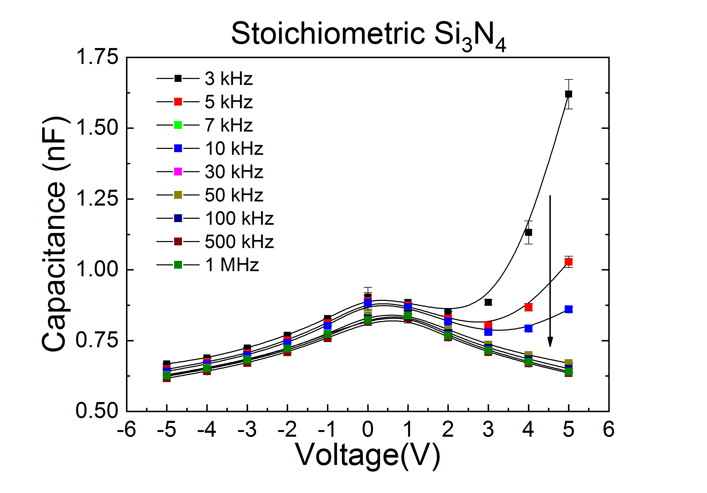

# LCR-characterization---BK-precision 895
Python codes for measuring capacitance vs frequency, capacitance vs DC bias voltage at different frequencies. An example plot of the capacitance measured as a function of different frequencies and applid bias voltage is shown in the figure below.
 
 

